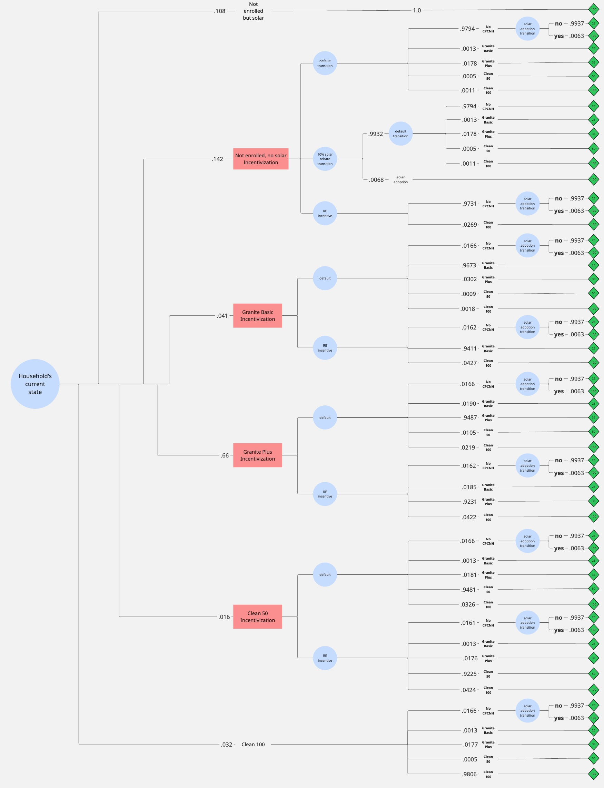

# Sustainable Hanover Incentive Planning
A decision-tree-based model for **uncertainty and decision-making** in allocating incentives for renewable electricity adoption in Hanover, supporting the Sustainable Hanover goal of **100% renewable electricity by 2030**.

**Core contributors:**  
@adayldrm → MILP implementation for incentive group prioritization.

---

## Project Overview

This project models:
* Optimal incentive allocation under uncertainty
* Expected utility calculations for different incentive strategies  
* Renewable energy adoption dynamics in Hanover

We implement a **decision tree** approach using custom node classes (`DecisionNode`, `ChanceNode`, `UtilityNode`) and integrate a MILP formulation for group prioritization.

---

## _nodes.py_ 
Contains classes that define the main types of nodes in a decision tree
### Decision Tree Build
Decision tree can be built by iteratively adding from leaves to root. For example:
```
leaf1 = UtilityNode(name="U1", utility=1)
leaf2 = UtilityNode(name="U2", utility=2)
leaf3 = UtilityNode(name="U3", utility=3)
leaf4 = UtilityNode(name="U4", utility=4)

branch1 = ChanceNode(name="C1", probabilities=[.3, .7], children=[leaf1, leaf2])
branch2 = ChanceNode(name="C2", probabilities=[.6, .4], children=[leaf3, leaf4])

root = DecisionNode(name='Root", children=[branch1, branch2])

root.visualize_decision_tree()
```

Decision tree can be built by iteratively adding from root to leaves. For example:
```
root = DecisionNode(name="Root")
root.add_children(ChanceNode(name="C1"), ChanceNode(name="C2"))

root.children[0].add_children(UtilityNode(name="U1", utility=1), UtilityNode(name="U2", utility=2), probabilities=[0.4, 0.6])
root.children[1].add_children(UtilityNode(name="U3", utility=3), probabilities=0.3)
root.children[1].add_children(UtilityNode(name="U4", utility=4), probabilities=0.7)

root.visualize_decision_tree()
```

Expected utility (EU) of a node is automatically calculated via backward induction:
* UtilityNode EU = UtilityNode.utility
* ChanceNode EU = EU of the children weighed by their probabilities
* DecisionNode EU = max EU of the children

## _model.py_ 
Contains a class _StnblHnvrDT_ specifically designed for the project. Automatically calculates the incentive transition matrices based on specified default transition matrices for solar system adoption and renewable energy enrollment based on incentive amounts provided.
### Arguments
* Renewable energy (RE) default Markov Chain transition probability matrix with states {NonEn, Granite, GranitePlus, Clean50, Clean100}
* PV System (PV) adoption energy default Markov Chain transition probability matrix with states {NoSolar, Solar}
* Incentive amounts for PV and RE to calculate transition probability matrix for RE or PV upon incentive introduction. Reprensented as fractions of product price refunded or a factor of probability increase.
* Price plasticity for PV or RE. Reflects _price_elasticiy_ * _%discount_ = _increase_in_transition_probability_

Decision tree generated is represented graphically below:



## milp.ipynb → MILP for Incentive Group Prioritization
Developed by @adayldrm to optimize which incentive groups receive priority.
